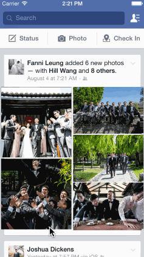

# fake-mailbox

Code path assignment 4 - fake facebook

Time spent: ~10 hours

- [x] Tapping on a photo in the news feed should expand the photo full screen.
- [x] Tapping the Done button should animate the photo back into its position in the news feed.
- [x]  On scroll of the full screen photo, the background should start to become transparent, (couldn't get this to reveal the feed.
)
- [x] If the user scrolls a large amount and releases, the full screen photo should dismiss.

